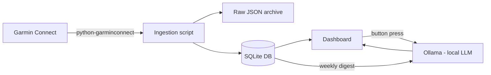

# Garmin Insights Dashboard — PRD

2026-09-19

> Original brief, kept as written. Three decisions changed after it: the
> dashboard is FastAPI plus React rather than Streamlit, and scheduled sync
> (v2) and alerting (v4) were dropped entirely. `CLAUDE.md` records why.

## Overview & Goals

A personal dashboard that pulls Seba's Garmin data (activities, sleep, HRV, stress, body battery, resting HR) and turns it into insight, not just charts. Built for a single user (Seba), self-hosted, no external accounts beyond Garmin Connect.

**Why:** Garmin Connect shows daily numbers but no correlation across metrics, no personal baselines, and no way to relate physiological data to life context (exam weeks, interviews, travel). This dashboard closes that gap.

**Goals:**

- See recovery/load trends relative to personal baseline, not absolute numbers
- Surface correlations Garmin doesn't (e.g. sleep quality vs next-day resting HR)
- Get proactive alerts instead of having to check a dashboard
- On demand, generate a natural-language weekly summary via a local LLM (Ollama) with one button press
- Own the data long-term (raw JSON archive, not locked into Garmin's app)

## Data Ingestion

**Source:** `python-garminconnect` (unofficial, actively maintained) logs into Garmin Connect and pulls activities, sleep, HRV, stress, body battery, steps and resting HR as JSON. No official Garmin developer API access is required.

**Storage — two layers:**

- **Raw layer:** every pull archived as JSON, untouched. Protects against the unofficial API breaking or Garmin changing a schema.
- **Transformed layer:** SQLite database with normalized daily/activity tables, computed rolling metrics, and manual life-event tags.

**Sync cadence:** daily scheduled pull (cron or n8n) for new data since the last successful sync. A one-time backfill run pulls history at setup, either via the API (paginated) or Garmin's bulk GDPR export if the API backfill is slow or rate-limited.

**Data quality:** each ingestion run checks expected fields are present per day (e.g. sleep record exists, HR data exists) and logs/flags gaps rather than silently leaving nulls that skew rolling averages.

## Core Metrics & Views

| View | What it shows |
| --- | --- |
| Baseline deviation | Each metric (HRV, resting HR, sleep score) shown as % deviation from Seba's own rolling 30-day average, not raw value |
| Correlation view | Overlay charts — HRV vs training load, sleep quality vs next-day resting HR, stress score vs calendar-heavy days |
| Training load | Acute:chronic workload ratio (7-day load / 28-day load) computed from golf and padel activity duration/intensity, to flag over/under-training risk |
| Life-event tags | Manually tagged date ranges (exam week, interview, travel) that any metric can be filtered or sliced by |

These views sit on top of the transformed SQLite layer — no view queries raw JSON directly.

## Weekly AI Summary (Ollama)

A button on the dashboard that, on click, generates a natural-language summary of the past 7 days using a locally-run LLM via Ollama — no data leaves the machine.

**Trigger:** manual button press (not scheduled), so it runs on demand rather than cluttering the dashboard with a summary nobody asked for yet.

**Data fed to the model:** a compact structured digest for the past 7 days, not raw tables — sleep score and duration, resting HR trend, HRV vs 30-day baseline, stress score average, training load (acute:chronic ratio), activity list, and any active life-event tags for the week.

**Model:** any Ollama-served local model (e.g. Llama 3.1 8B or similar) — exact model TBD based on what runs acceptably on Seba's hardware; should be swappable without code changes.

**Output:** a short written summary (3-6 sentences) covering: how the week's recovery/load compares to baseline, anything notable (a flagged anomaly, a life-event tag effect), and one practical observation. Displayed inline on the dashboard, copyable, and optionally saved to the DB as a dated record so past summaries are browsable.

**Failure handling:** if Ollama isn't running locally, the button shows a clear error rather than failing silently or falling back to a cloud API (this feature is local-only by design).

## Alerting

Rather than requiring a daily dashboard check, the ingestion script flags conditions worth attention and pushes a message — same pattern as the existing Kindle news digest automation.

**Candidate triggers:**

- Resting HR trending up 3+ consecutive days
- HRV dropping below 30-day baseline by a set threshold
- Sleep debt accumulating over a rolling window
- Acute:chronic training load ratio entering an over/under-training range

**Delivery:** Telegram or email, via n8n, sent only when a threshold fires.

Exact thresholds are tunable and should start conservative (fewer, higher-confidence alerts) to avoid alert fatigue, then loosen once the baseline data is trusted.

## Non-Functional Requirements

- **Local-only by default:** dashboard, DB, and LLM summary all run on Seba's own hardware/network — no cloud dependency beyond the Garmin Connect login itself.
- **Raw data backup:** every raw JSON pull retained (not just the transformed DB), so a future schema change or bug in the transform layer doesn't cost historical data.
- **Data quality checks:** ingestion flags missing days (watch not worn, sync failure) rather than letting nulls silently skew rolling averages.
- **Resilience to upstream breakage:** `python-garminconnect` is unofficial and could break if Garmin changes something; ingestion failures should be visible (logged/alerted), not silent.

## Technical Architecture

**Stack choices:**

| Layer | Choice | Why |
| --- | --- | --- |
| Ingestion | Python + python-garminconnect | Unofficial but actively maintained, covers all needed metrics |
| Storage | SQLite | Single-user, zero-infra, plenty for this data volume |
| Dashboard | Streamlit (v1) then Grafana (v2 optional) | Superseded: see CLAUDE.md |
| Automation | n8n | Dropped: nothing runs on a schedule |
| Weekly summary | Ollama (local) | Keeps health data off any cloud service |

## Milestones

1. **v1 — Ingestion foundation:** authenticate `python-garminconnect` locally, validate data quality on one activity type, set up raw JSON archive + SQLite schema, backfill history.
2. **v2 — Core dashboard:** daily automated sync, dashboard with baseline-deviation views for the 5-10 metrics that matter most.
3. **v3 — Insight layer:** correlation views, acute:chronic training load, life-event tagging.
4. **v4 — Alerting:** anomaly thresholds, Telegram/email delivery.
5. **v5 — Weekly AI summary:** Ollama integration, button-triggered digest generation, saved summary history.

## Out of Scope

- Multi-user support or auth (single-user tool for Seba)
- Cloud hosting or remote access (local-first by design)
- Real-time/live syncing
- Official Garmin developer API partnership (unofficial library is enough for personal use)
- Mobile app (dashboard accessed via browser)

## Open Questions

- [ ] Which local model runs acceptably on Seba's hardware for the weekly summary?
- [ ] Should past weekly summaries be browsable in the dashboard, or is a simple DB record enough for now?
- [ ] Exact alert thresholds — start conservative and tune after a few weeks of real baseline data?
- [ ] Streamlit vs Grafana as the long-term dashboard?
